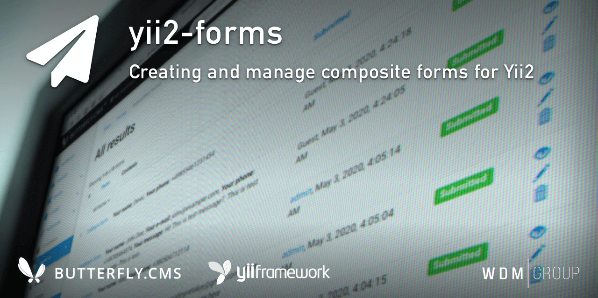

# Yii2 Forms
Module for creating and administering composite forms for Yii2. It also records and manages the results of filling out forms on the site. It has its own component for building and displaying forms in the frontend. Supports multilingual fields and descriptions.

This module is an integral part of the [Butterfly.СMS](https://butterflycms.com/) content management system, but can also be used as an standalone extension.

Copyrights (c) 2019-2021 [W.D.M.Group, Ukraine](https://wdmg.com.ua/)

# Requirements 
* PHP 5.6 or higher
* Yii2 v.2.0.40 and newest
* [Yii2 Base](https://github.com/wdmg/yii2-base) module (required)

# Installation
To install the module, run the following command in the console:

`$ composer require "wdmg/yii2-forms"`

After configure db connection, run the following command in the console:

`$ php yii forms/init`

And select the operation you want to perform:
  1) Apply all module migrations
  2) Revert all module migrations
  3) Add demo data

# Migrations
In any case, you can execute the migration and create the initial data, run the following command in the console:

`$ php yii migrate --migrationPath=@vendor/wdmg/yii2-forms/migrations`

# Configure

To add a module to the project, add the following data in your configuration file:

    'modules' => [
        ...
        'forms' => [
            'class' => 'wdmg\forms\Module',
            'routePrefix' => 'admin'
        ],
        ...
    ],

# Usage examples
To build the ActiveForm with fields you may use the component method Yii::$app->forms->build() with `id` or `alias` of form item.

**View in frontend**

    <?php
        use yii\widgets\ActiveForm;
        ...
    ?>
        
    <h3>Feedback</h3>
    <?php $form = ActiveForm::begin(); ?>
    <?= Yii::$app->forms->build($form, 'feedback-form'); ?>
    <?= Html::submitButton('Submit') ?>
    <?php ActiveForm::end(); ?>
    ...
    
    <h3>Callback</h3>
    <?php $form = ActiveForm::begin(); ?>
    <?= Yii::$app->forms->build($form, 'сallback-form'); ?>
    <?= Html::submitButton('Submit') ?>
    <?php ActiveForm::end(); ?>

**Action in Controller**

    <?php
        if (!is_null($result = Yii::$app->forms->submit('feedback-form', $data))) {
            if ($result === true) {
                Yii::$app->session->setFlash('success', 'Your Feedback form successfully submitted!');
            } else {
                Yii::$app->session->setFlash('danger', 'An error occurred while sending the Feedback form.');
            }
        }
    ?>

# Routing
Use the `Module::dashboardNavItems()` method of the module to generate a navigation items list for NavBar, like this:

    <?php
        echo Nav::widget([
        'options' => ['class' => 'navbar-nav navbar-right'],
            'label' => 'Modules',
            'items' => [
                Yii::$app->getModule('forms')->dashboardNavItems(),
                ...
            ]
        ]);
    ?>

# Status and version [ready to use]
* v.1.2.0 - Update copyrights, fix menu dashboard
* v.1.1.2 - RBAC implementation
* v.1.1.1 - Update README.md and setAttributeLabels() fixed
